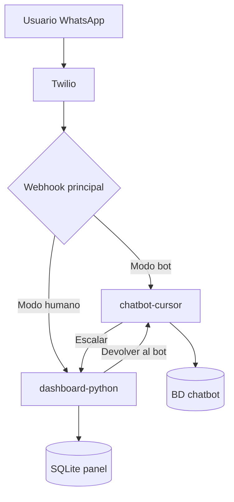

# Integración futura con chatbot-cursor

Este documento describe cómo conectar **manualmente** el panel `dashboard-python` con el proyecto del chatbot en `Escritorio/chatbot-cursor`. **No modifiques archivos del chatbot desde este repo**; copia o adapta los fragmentos en tu entorno cuando decidas integrar.

---

## 1. Transferir una conversación del chatbot a un humano

### Objetivo

Cuando el bot no pueda resolver la consulta, un operador humano debe ver y responder la misma conversación en el panel.

### Enfoque recomendado: flag de “modo humano” por número

1. **En el chatbot** (`chatbot-cursor`), al detectar escalamiento (palabra clave, intención, o comando `/humano`):
   - Guardar en su base de datos o archivo: `contact_number` → `mode: human`
   - Dejar de llamar al LLM para ese número
   - Opcional: enviar mensaje al usuario: *"Te conectamos con un agente."*

2. **En el panel** (`dashboard-python`), los mensajes ya se guardan en SQLite. El humano usa la misma app sin cambios si el webhook de Twilio apunta al panel **o** si ambos sistemas comparten la misma URL de webhook (ver sección 6).

3. **Webhook único**: Solo un servicio puede recibir el POST de Twilio por número/cuenta. Opciones:
   - **A)** Webhook → panel; el chatbot lee mensajes desde SQLite/API que expongas tú.
   - **B)** Webhook → chatbot; el chatbot reenvía a un endpoint local del panel cuando `mode == human`.
   - **C)** Proxy ligero que enruta según `mode`.

### Ejemplo mínimo en el chatbot (pseudocódigo Python)

Copia este patrón en el handler de mensajes entrantes del chatbot, por ejemplo en algo equivalente a `routes/webhook.py` o `handlers/whatsapp.py`:

```python
# chatbot-cursor — EJEMPLO, no está en dashboard-python
HUMAN_MODE = {}  # mejor: tabla SQLite/redis

def handle_incoming(from_number: str, body: str):
    if HUMAN_MODE.get(from_number):
        # No procesar con IA; opcional: POST al panel
        forward_to_panel(from_number, body)
        return

    if should_escalate(body):
        HUMAN_MODE[from_number] = True
        send_whatsapp(from_number, "Un agente te atenderá en breve.")
        notify_panel_escalation(from_number)
        return

    reply = run_chatbot(body)
    send_whatsapp(from_number, reply)


def forward_to_panel(from_number: str, body: str):
    import requests
    requests.post(
        "http://localhost:5000/webhook/whatsapp",
        data={
            "From": f"whatsapp:{from_number}",
            "Body": body,
            "MessageSid": "",  # el panel deduplica por SID si viene vacío
        },
        timeout=5,
    )
```

### Cambios mínimos en el panel

| Archivo | Cambio |
|---------|--------|
| `app/persistence/database.py` | Tabla opcional `conversation_meta (contact_number, handled_by, mode)` |
| `app/services/conversation_service.py` | Leer `mode` al abrir chat; filtrar lista “En atención humana” |
| `app/gui/sidebar.py` | Badge “Humano” / “Bot” |

Ejemplo de columna extra (copiar en `database.py`):

```python
# Migración manual en dashboard-python
"""
ALTER TABLE conversations ADD COLUMN handler_mode TEXT DEFAULT 'human';
-- valores: 'human' | 'bot'
"""
```

---

## 2. Devolver la conversación al chatbot

### Objetivo

Cuando el agente termine, el flujo automático debe reactivarse.

### Pasos

1. En el panel, botón **“Devolver al bot”** que:
   - Llama a un endpoint o archivo compartido que el chatbot lee, **o**
   - Escribe `handler_mode = 'bot'` y notifica al chatbot por HTTP.

2. En el chatbot:

```python
def release_to_bot(from_number: str):
    HUMAN_MODE.pop(from_number, None)
    send_whatsapp(
        from_number,
        "Gracias por contactarnos. Si necesitas más ayuda, escribe aquí.",
    )
```

3. El panel puede registrar el evento en logs:

```python
# dashboard-python — ejemplo en conversation_service.py
def release_to_bot(self, conversation_id: int):
    conv = self.db.get_conversation(conversation_id)
    if not conv:
        return False
    # actualizar handler_mode en BD
    # requests.post("http://localhost:PUERTO_CHATBOT/release", json={"number": conv.contact_number})
    return True
```

### Archivos del panel donde agregar el botón

| Archivo | Qué agregar |
|---------|-------------|
| `app/gui/chat_view.py` | Botón “Devolver al bot” en el header |
| `app/gui/app.py` | Callback `on_release_to_bot` |
| `app/services/conversation_service.py` | Método `release_to_bot()` |

---

## 3. Cambios mínimos resumidos

| Sistema | Cambio |
|---------|--------|
| Chatbot | Mapa o BD `human_mode` por número; dejar de responder con IA en modo humano |
| Chatbot | Función `forward_to_panel()` o URL webhook compartida |
| Panel | Columna `handler_mode` (opcional) + botón liberar |
| Twilio | Una sola URL “When a message comes in” o proxy de enrutamiento |
| Red | Misma máquina o API HTTP entre procesos (`localhost`) |

---

## 4. Ejemplos de API interna (opcional)

Si prefieres no tocar el webhook de Twilio, expón en el panel un mini-endpoint (copiar a `webhook_server.py`):

```python
@app.route("/api/escalate", methods=["POST"])
def escalate():
    data = request.get_json()
    number = data.get("contact_number")
    # marcar conversación; crear si no existe
    return {"ok": True}, 200


@app.route("/api/release", methods=["POST"])
def release():
    data = request.get_json()
    number = data.get("contact_number")
    # marcar mode=bot; el chatbot consulta o recibe POST
    return {"ok": True}, 200
```

Desde el chatbot:

```python
requests.post("http://localhost:5000/api/escalate", json={"contact_number": "+525551234567"})
```

---

## 5. Archivos donde habría que agregar cambios

### En `dashboard-python` (este proyecto)

- `app/persistence/database.py` — esquema `handler_mode`, timestamps de escalamiento
- `app/services/conversation_service.py` — `escalate()`, `release_to_bot()`
- `app/services/webhook_server.py` — rutas `/api/escalate`, `/api/release` (opcional)
- `app/gui/chat_view.py` — botones de acción del agente
- `app/gui/app.py` — enlazar callbacks

### En `chatbot-cursor` (copiar manualmente, no desde aquí)

Busca en tu proyecto del chatbot archivos equivalentes a:

- Handler del webhook de Twilio / WhatsApp
- Lógica del LLM o reglas de respuesta
- Configuración de Twilio (`.env`, `config.py`)
- Persistencia de sesión por usuario/número

Nombres típicos (pueden variar en tu repo):

- `app.py`, `main.py`, `bot.py`
- `webhook.py`, `twilio_handler.py`, `whatsapp.py`
- `conversation.py`, `session_store.py`

---

## 6. Pasos manuales de despliegue integrado

1. **Decidir arquitectura de webhook**
   - Recomendado para empezar: webhook → **chatbot**; en modo humano, `forward_to_panel()`.

2. **Copiar variables de entorno**
   - Del chatbot al panel (o viceversa): mismos `TWILIO_ACCOUNT_SID`, `TWILIO_AUTH_TOKEN`, `TWILIO_WHATSAPP_FROM`.
   - No subas `.env` a git.

3. **Levantar ambos procesos**
   ```bash
   # Terminal 1 — panel
   cd dashboard-python
   python run.py

   # Terminal 2 — chatbot (en su carpeta)
   cd ../chatbot-cursor
   # comando que uses habitualmente
   ```

4. **ngrok** (si Twilio está en la nube)
   - Un túnel al puerto del proceso que recibe el webhook principal.
   - Si el chatbot reenvía al panel, el panel también necesita ser alcanzable en `localhost` (misma PC) sin ngrok extra.

5. **Probar escalamiento**
   - Envía mensaje de prueba → bot responde.
   - Activa modo humano (comando o regla).
   - Verifica que el mensaje aparece en el panel.
   - Responde desde el panel; el usuario recibe por Twilio API (ya implementado).

6. **Probar liberación**
   - Pulsa “Devolver al bot” (cuando lo implementes).
   - Envía nuevo mensaje; el chatbot debe responder de nuevo.

7. **Evitar duplicados**
   - Usa `MessageSid` de Twilio en ambos sistemas para no guardar el mismo mensaje dos veces (el panel ya deduplica por SID).

---

## 7. Qué copiar manualmente entre proyectos

| Origen | Destino | Qué copiar |
|--------|---------|------------|
| `chatbot-cursor/.env` | `dashboard-python/.env` | Credenciales Twilio (misma cuenta) |
| `dashboard-python/app/services/webhook_server.py` | Referencia en chatbot | Formato POST que espera Twilio |
| `dashboard-python/INTEGRACION_CHATBOT.md` | — | Esta guía |
| Lógica de escalamiento del chatbot | Nuevo archivo en panel | Solo si unificas BD; no obligatorio |

**No copies** carpetas enteras entre repos; integra por HTTP o por reglas de webhook compartidas.

---

## 8. Diagrama de flujo (referencia)



---

## 9. Contacto y mantenimiento

- Mantén esta integración **fuera** del código por defecto hasta que definas una sola URL de webhook.
- Documenta en tu wiki interna qué puertos usan panel (`WEBHOOK_PORT`) y chatbot.
- Para soporte Twilio: [Documentación WhatsApp Twilio](https://www.twilio.com/docs/whatsapp).
